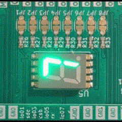
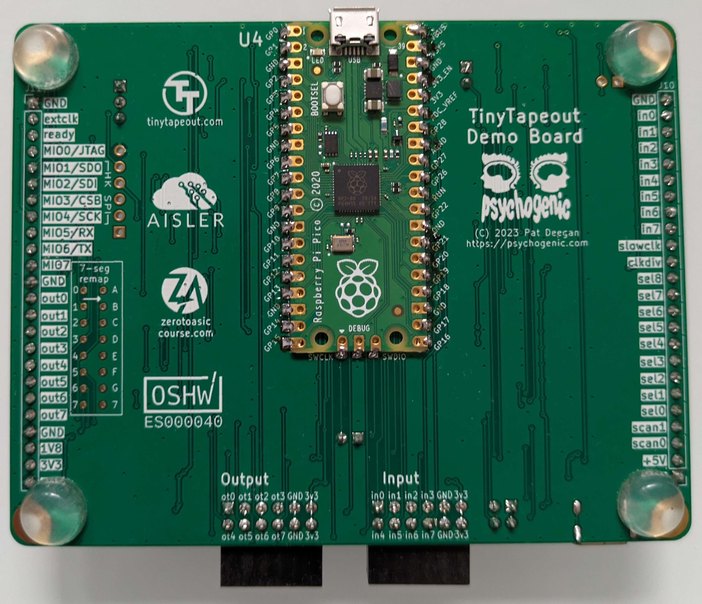
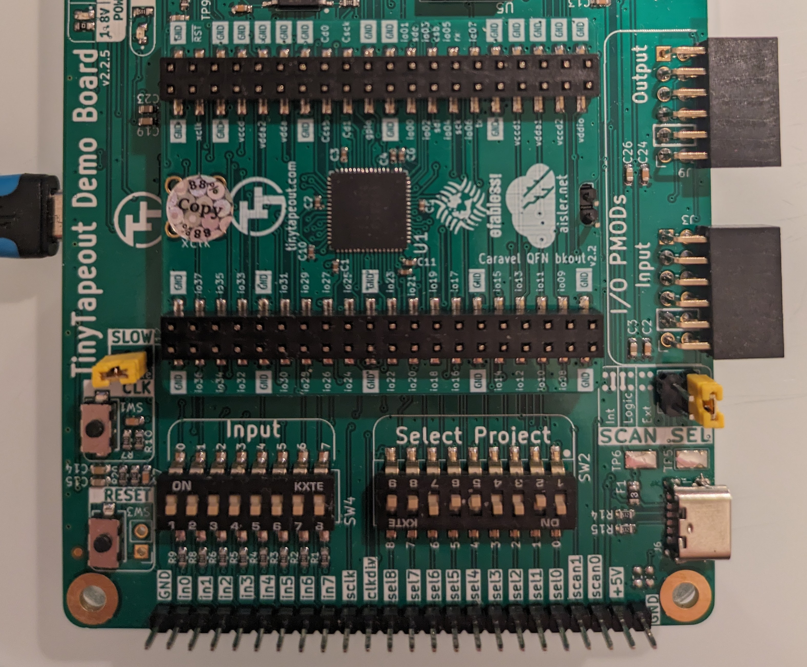

# Raspberry Pico based test setup for "TrainLED"

This folder contains micropython programs that can be used in combination with a Raspberry Pico (or similar RP2040 board) to test the [TrainLED design](https://tinytapeout.com/runs/tt02/077/) for TinyTapout2. 

TrainLED implements a three channel PWM driver for LEDs, that can be programmed with a single wire interface similar to a WS2812. Due to the slow clockrate in the tt02 design, everything is much slower. To accommodate for the slow PWM clock rate, a special dither algorithm based on a low-resolution PWM in combination with an error diffusion logic is used to achieve a higher effective PWM frequency and suppress flickering as much as is possible.

In tt02, the design is clocked with 2455 Hz, resulting in an encoding of a one with a 3530 µs pulse and a zero with 1630 µs, about 4000x slower than a real WS2812. To achieve the same protocol timing as the WS2812, the design would have to be clocked at 9.6 Mhz. 

Amazingly, the design still works properly and is able to fade the LED outputs in a somewhat non-flickery way. See fade animation below, where each of the three channels is mapped to one segment in the 7-segment display.

  

## 📂 Description of files

- `measure_slow_clock.py`: MicroPython program to measure the slow clock frequency on GPIO10. This requires soldering a wire from the slow clock pin to the GPIO10 input. The result will be printed to the console. This should be 2456 Hz with the given switch configuration in TinyTapue
- `TrainLED_tt02_blink.py`: Will blink the three LED outputs in two states.
- `TrainLED_tt02_blink.py`: Will fade the three LED outputs in a sequence.
  
## 📦 Prerequisites

- A Raspberry Pi Pico has to be soldered to the rear side of the TinyTapeout Demo Board (see picture below).
- The micropython uf2 image has to be installed on the Pico. [Latest image](https://micropython.org/download/RPI_PICO/). I am using the 'micropico' plugin for VSCODE as a development environment, but others may work as well.
- The board should be powered only by the USB port on the Pico.
- The *SLOW_CLK* jumper needs to be *set*. 
- All *Input* switches need to be in the "off" position.
- The *Select project* switches need to be configured to select the TrainLED design. (see picture below)

## Mounted Raspberry Pico on TinyTapeout Demo Board

  

## Switch configuration

  

